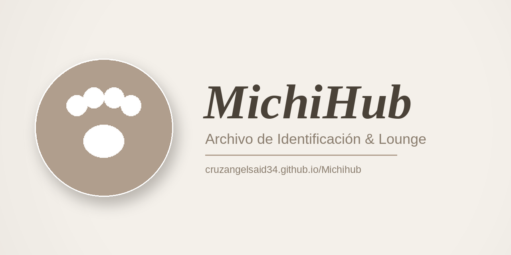
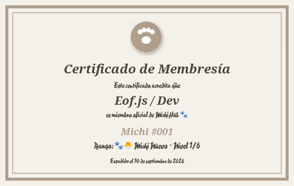

  

# michihub-Eofjsdev

### ¡Bienvenido, Eof.js / Dev! 🐾✨

Gracias por iniciar sesión en **MichiHub** con tu cuenta de GitHub. Este repositorio se creó automáticamente solo para ti el **30 de septiembre de 2026**, como parte de tu cuenta dentro del lounge.

Tu rango actual dentro de MichiHub es **🐾🐣 Michi Nuevo**, según cuánto tiempo llevas como miembro.

**Nivel 1 de 6** ▰▱▱▱▱▱

| Nivel | Rango | Se alcanza con |
|:--:|:--|:--|
| 1 | 🐾🐣 **Michi Nuevo** 👈 | Recién llegado |
| 2 | 🐾🐱 Michi Aprendiz | 7 días |
| 3 | 🐾😺 Michi Regular | 1 mes |
| 4 | 🐾😼 Michi Experto | 3 meses |
| 5 | 🐾🎖️ Michi Veterano | 6 meses |
| 6 | 🐾👑 Michi Leyenda | 1 año |

MichiHub es un espacio con minijuegos, credenciales, radio en vivo, chat, almacenamiento en la nube y más, todo con un toque de gatitos 🐱.

> Este repo es tuyo: puedes usarlo, editarlo o borrarlo cuando quieras. Si cierras sesión en MichiHub, se elimina automáticamente y se vuelve a crear la próxima vez que entres.

---

### 🏅 Tu certificado de membresía

---

### 🐱 Tu michi y tus contribuciones

Un gatito recorre tu gráfico de contribuciones de GitHub y se las va comiendo.

---

© 2026 MichiHub™ · Ángel Said Cruz Muñoz. Todos los derechos reservados.
